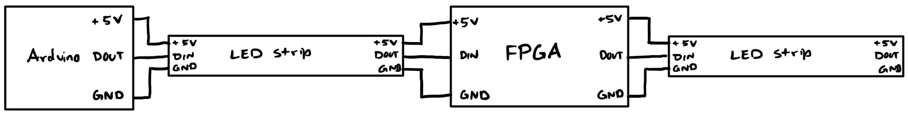
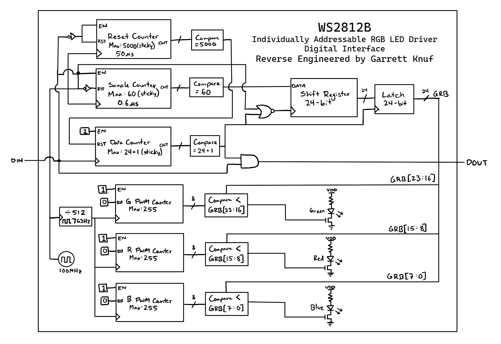

# WS2812B Digital Design 

Individually Addressable RGB LED Driver Digital Interface
  
Reverse-engineered from [WS2812B Datasheet](https://cdn-shop.adafruit.com/datasheets/WS2812B.pdf)

## Test Setup
* Arduino sends commands through `DIN` to WS2812B ICs
* ICs are connected in a cascade, receiving data on `DIN` and transmitting data on `DOUT`
* Basys 3 Artix-7 FPGA connected on daisy chain to emulate WS2812B behavior

## Digital Interface Architecture
* Implemented in Verilog with an Basys 3 Artix-7 FPGA
* FPGA uses 100 MHz internal clock for system timing
  

